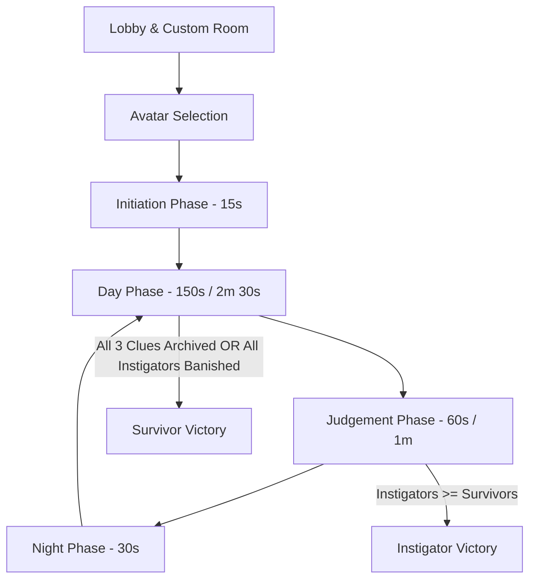
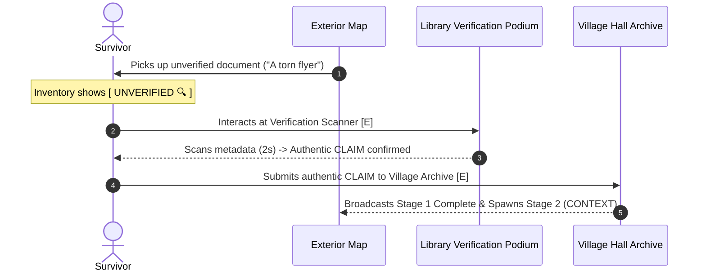

# Dusk Village: Gameplay Mechanics & Architecture Guide

Dusk Village is a 2D top-down social deduction and media literacy mystery game. In this game, survivors work together to uncover the truth behind village controversies, while hidden instigators attempt to derail investigations, plant fabricated evidence, and outnumber the survivors.

---

## 1. Core Game Lifecycle & Phase Timings

The game alternates through distinct, synchronized phases to balance exploration, deduction, and action.

### Phase Breakdown

| Phase | Duration | Core Gameplay & Rules |
| :--- | :--- | :--- |
| **Initiation** | **15 seconds** | Players start inside their private cottages. The game reveals secret roles (*Survivor* or *Instigator*) alongside a 15-second countdown timer and briefing card. |
| **Day Phase** | **150 seconds (2m 30s)** | All living players teleport to the **Village Square surrounding the Angel Statue**. Day 1 announces the Mystery Title. Players explore the village, gather clue fragments, scan documents in the Library, and file verified reports in the Village Hall. |
| **Judgement Phase** | **60 seconds (1m)** | The village council gathers in a circle around the central statue. Players discuss suspect behaviors and vote to forgive or banish an accused player. The game preserves the verdict until daybreak. |
| **Night Phase** | **30 seconds** | The screen transitions through a smooth camera blackout. Survivors remain indoors in their cottages. Instigators roam freely in the dark to plant fake documents or lock buildings. |

---

## 2. Sequential 3-Stage Investigation & Library Verification

Survivors win the game by reconstructing the full truth through a 3-stage factual matrix: **Claim**, **Context**, and **Source**.

### 1. Exterior Open Spawns
Clue fragments spawn strictly in open, accessible exterior areas—including the School Courtyard, Clinic Gardens, Village Square, Library Walkways, Village Hall Plaza, and South Orchard paths. Clues never appear inside private homes or on roofs.

### 2. Surface Names & Decoys
When a player finds a document on the ground, the item displays only a generic surface label (for example, *"A grocery receipt"*, *"A torn flyer"*, or *"An urgent red notice"*). It enters the player's inventory as `[ UNVERIFIED 🔍 ]`. Decoy documents also spawn across the map to test player scrutiny.

### 3. Library Verification Scanner
To determine whether an item contains authentic facts or misleading decoys, a survivor brings the document to the **Library Verification Station**:
- The scanner runs a 2-second document and metadata check.
- Authentic clues reveal their full title, description, and proof text.
- Irrelevant or forged decoys are flagged as fake.

### 4. Village Hall Archive Delivery
Once a player holds a verified authentic clue matching the active stage, they deliver it to the **Village Hall Archive**:
- **Stage 1 (CLAIM)**: Filing the claim completes Stage 1 and immediately spawns Stage 2 (CONTEXT) fragments across the village.
- **Stage 2 (CONTEXT)**: Filing the context clue completes Stage 2 and spawns Stage 3 (SOURCE) fragments.
- **Stage 3 (SOURCE)**: Filing the source document proves the complete truth and immediately triggers **Survivor Victory**!

---

## 3. Instigator Sabotages & Night Operations

Instigators work secretly to disrupt the investigation during the Night Phase:

1. **Building Lockouts (20 Seconds)**:
   - Instigators can lock any key public building (such as the Library, Clinic, School, or Village Hall).
   - When dawn arrives, locked buildings display warning indicators and prevent entry for 20 seconds.
2. **Planting Fabricated Documents**:
   - Instigators can forge fake fragments and plant them anywhere in the exterior world to waste survivors' time and mislead discussions.

---

## 4. Council Eviction & Win Conditions

### Daybreak Council Report
Judgement votes resolve at the conclusion of the Judgement Phase. When the next Day Phase begins, the game broadcasts a formal **Daybreak Council Report** banner and town message:
- If the town successfully votes to evict: reveals the banished player's name and role.
- If the vote ends in a tie or no candidate was nominated: announces that no eviction occurred.

### Win Conditions
- **Survivor Victory**:
  - The survivors verify and deliver all three clue stages (`CLAIM` $\rightarrow$ `CONTEXT` $\rightarrow$ `SOURCE`) to the Village Hall Archive, **OR**
  - The town council banishes all three Instigators.
- **Instigator Victory**:
  - The number of living Instigators equals or exceeds the number of living Survivors (for example, 2 Instigators vs 2 Survivors).

---

## 5. Technical Architecture Overview

| Component / File | Purpose & Responsibilities |
| :--- | :--- |
| [`Constants.js`](file:///c:/duskvillage/src/client/utils/Constants.js) | Centralizes all client-side configuration parameters, phase durations (15s initiation, 150s day, 60s judgement, 30s night), and speed constants. |
| [`GameSession.js`](file:///c:/duskvillage/src/server/GameSession.js) | Manages server-side authoritative state, handles phase clocks, executes bot behaviors, coordinates fragment spawns, checks win conditions, and verifies document submissions. |
| [`MysteryRegistry.js`](file:///c:/duskvillage/src/server/MysteryRegistry.js) | Stores UNESCO Media & Information Literacy (MIL) mystery scenarios, authentic claim/context/source datasets, and decoy document templates. |
| [`GameScene.js`](file:///c:/duskvillage/src/client/scenes/GameScene.js) | Renders the exterior village world, drives camera blackout transitions, synchronizes remote players, and announces Day 1 mystery titles. |
| [`InteriorScene.js`](file:///c:/duskvillage/src/client/scenes/InteriorScene.js) | Renders interior building rooms, handles cottage night lockdowns, and manages the Library Verification Station and Village Hall Archive Station. |
| [`HUDManager.js`](file:///c:/duskvillage/src/client/ui/HUDManager.js) | Manages player list panels, active inventory items, stage matrix progress trackers, and announcement toast banners. |
